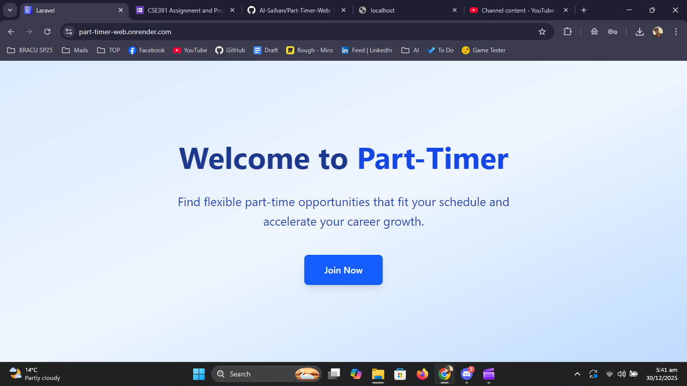
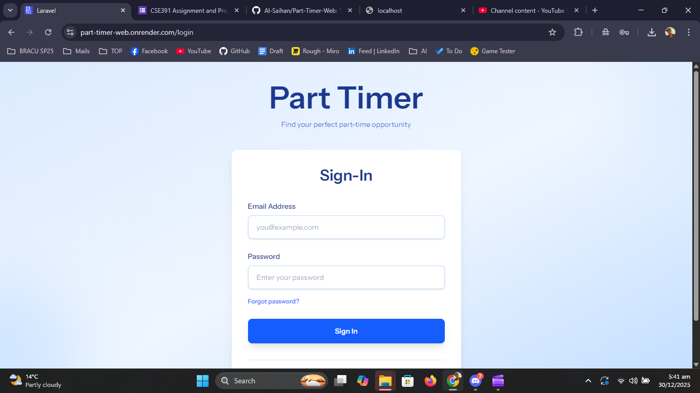
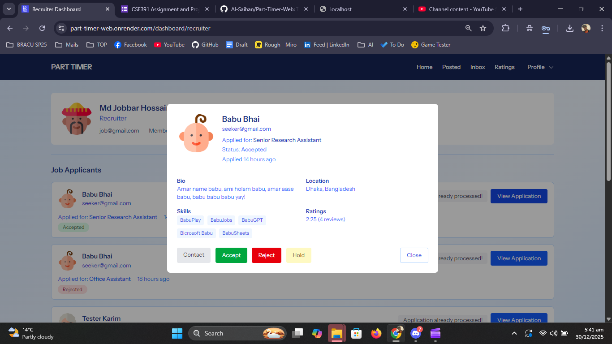
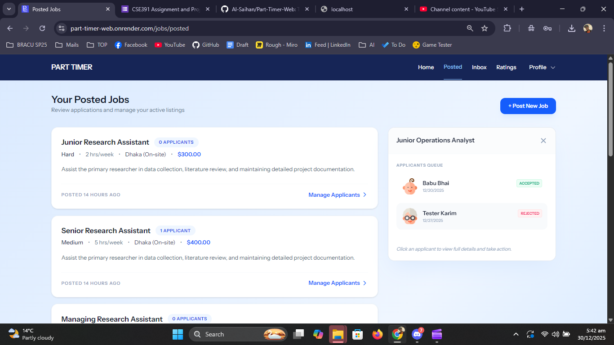
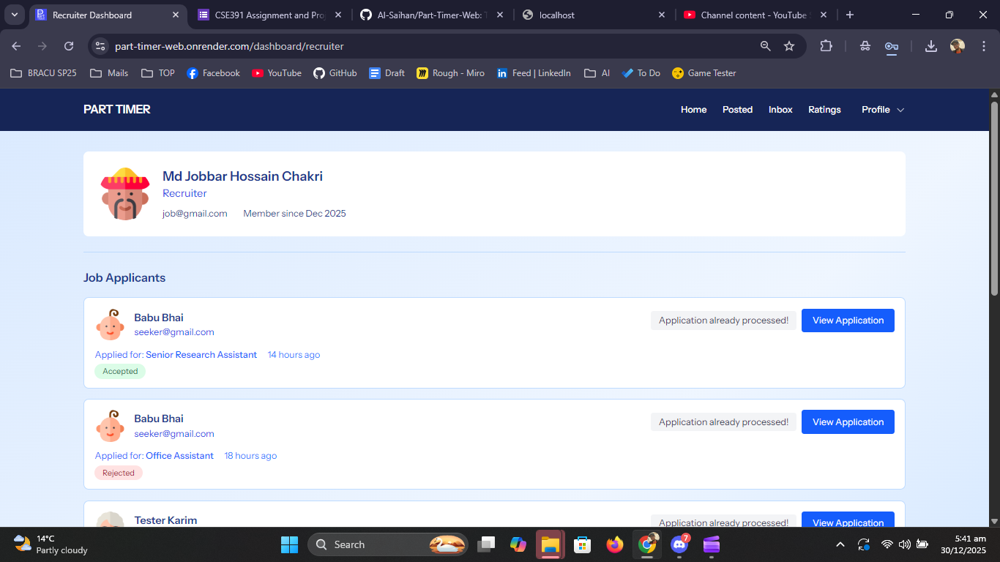
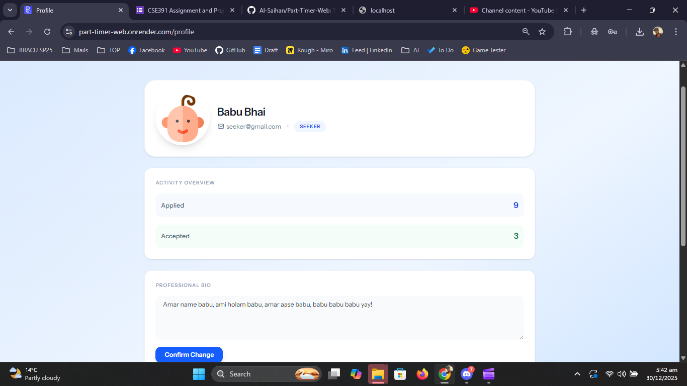
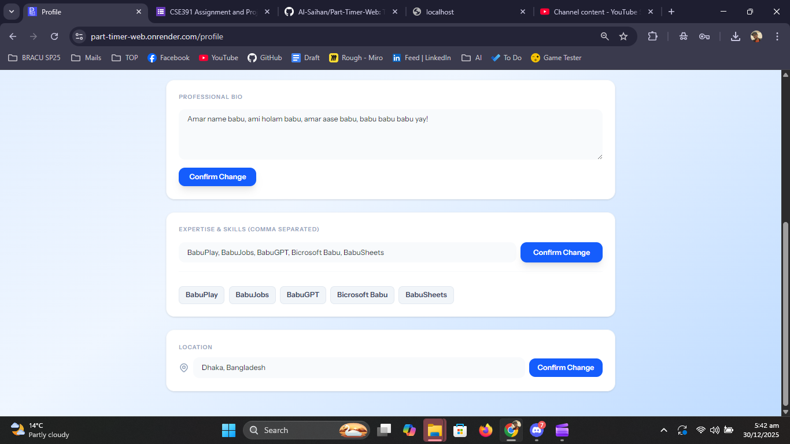
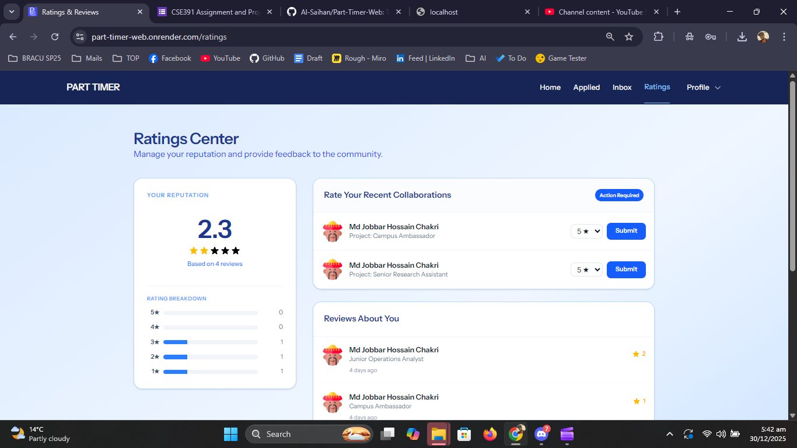

# Part-Timer-Web

A Laravel + Livewire application that connects part-time job seekers with recruiters. This repository contains a work-in-progress job marketplace with role-based users, job postings, applications, basic chat, and rating features. The project is intended for learning, prototyping, and small demos.

---

## Table of contents

- [Features](#features)
- [Tech stack](#tech-stack)
- [Requirements](#requirements)
- [Quick start](#quick-start)
- [Testing](#testing)
- [Deployment notes (free option)](#deployment-notes-free-option)
- [Known issues](#known-issues)
- [Roadmap](#roadmap)
- [Contributing](#contributing)
- [License](#license)

---

## Features

- Role-based users: `job seeker` and `recruiter`
- User profiles and account management
- Recruiter job posting (descriptions, requirements, hours)
- Requirements-based job validation for part-time suitability
- Quick-apply flow for job seekers
- User ratings and basic reputation tracking
- In-app chat (non-real-time)
- Livewire-driven reactive UI (minimal frontend JS)

---

## Tech stack

- PHP 8.2
- Laravel Framework (v12)
- Livewire (Flux & Volt)
- Laravel Fortify (authentication)
- Laravel Sanctum (session/API protection)
- Tailwind CSS (via Vite)
- Vite for asset bundling
- Composer (PHP deps) and npm (JS tooling)

---

## Requirements

- PHP 8.2+
- Composer
- Node.js and npm
- A database (MySQL / PostgreSQL) and optional Redis for sessions/queues

---

## Quick start

1. Copy environment and install dependencies

Unix / WSL / macOS

```bash
cp .env.example .env
composer install
npm ci
```

Windows PowerShell

```powershell
copy .env.example .env
composer install
npm ci
```

2. Generate app key and run migrations

```bash
php artisan key:generate
php artisan migrate --force
```

3. Build assets (development)

```bash
npm run dev
```

4. Serve the app (example)

```bash
php artisan serve
# then open http://localhost:8000
```

Notes:
- For production, build assets with `npm run build` and deploy compiled files.


## Screenshots

Below are screenshots demonstrating the app UI and key flows. Images are stored in the `documentaiton/` folder.

- Landing page: 
- Sign-in page: 
- Job detail: 
- Posted jobs (recruiter): 
- Recruiter dashboard: 
- Profile section: 
- Seeker extra profile: 
- Ratings view: 
## Testing
Run the test suite:

```bash
php artisan test
```

---

## Deployment notes (free option)

If you want a free or low-cost hosting path for demos, the recommended approach is:

- App: Fly.io (free tier) — deploy a Dockerized Laravel app
- Database: Neon (serverless Postgres free tier) or PlanetScale (serverless MySQL free tier)
- Redis: Upstash (free tier) for sessions/queues

Steps (high level):

1. Create the DB and Redis on the chosen providers.
2. Add connection strings as secrets on Fly (or your host).
3. Build assets in CI or Docker, deploy the app image to Fly.
4. Run migrations remotely and set `APP_KEY`.

This composition gives a reliable free-tier setup suitable for demos and development. If you prefer, I can add a sample `Dockerfile`, `fly.toml`, and exact commands for Windows PowerShell.

---

## Known issues

- Password/email reset flow needs configuration (email sending and notification templates).
- Chat is not real-time; messages require refresh.
- Profile image upload and validation need improvement.

If you run into CSRF or AJAX session issues, verify pages include the CSRF meta tag and that client fetch calls include credentials (e.g. `credentials: 'same-origin'`).

---

## Roadmap

- Fix password reset + email notifications
- Add real-time chat using Laravel Echo / Pusher or Socket server
- Improve image uploads and storage (S3)
- Add career/work history tracking
- Add notifications, activity logs, and performance optimizations

---

## Contributing

Contributions are welcome. Please open issues for bugs or features, and create pull requests for fixes. Keep changes focused and include tests where applicable.

Key files:

- Main auth flow: `app/Providers/FortifyServiceProvider.php`
- Custom password reset: `app/Http/Controllers/Auth/PasswordResetController.php` and `resources/views/livewire/auth/forgot-password.blade.php`

---